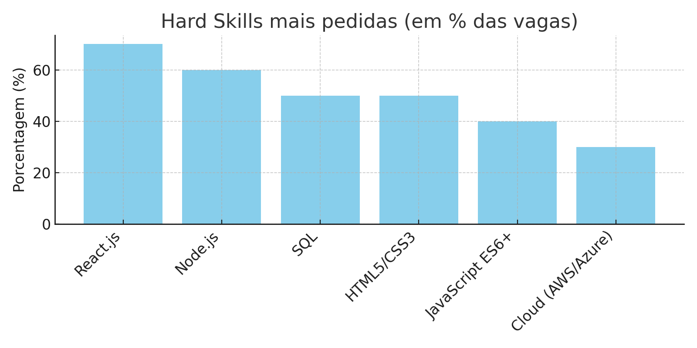
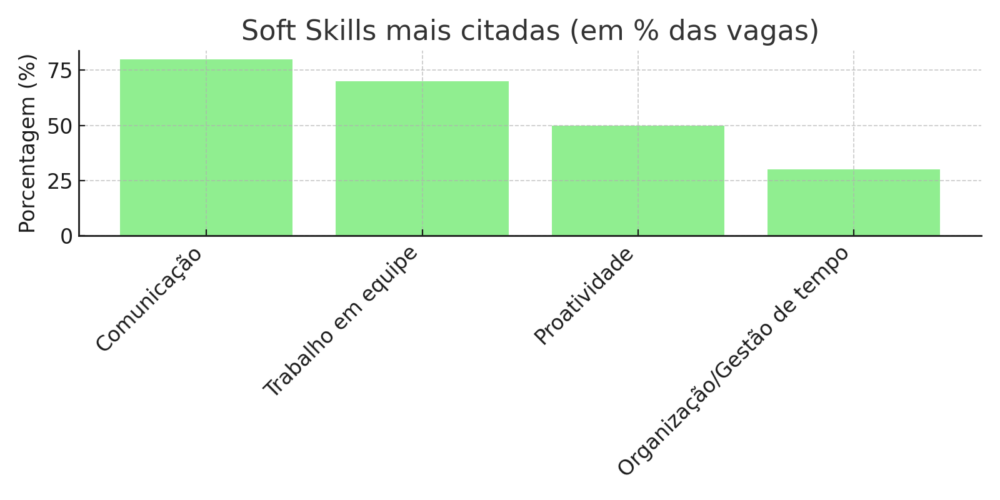
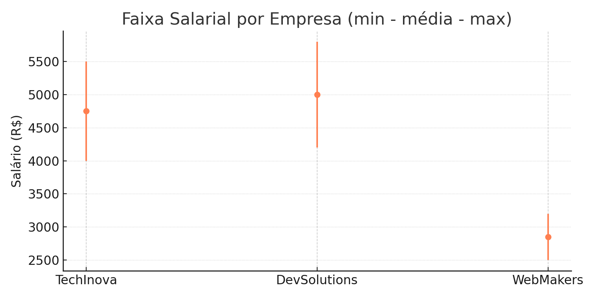

# 📊 Relatório de Análise — Desenvolvedor Web Júnior (2025)

## 🎯 Objetivo Geral
Realizar uma pesquisa de mercado em TI para identificar as **hard skills**, **soft skills** e **faixas salariais** mais relevantes para a função de Desenvolvedor Web Júnior, orientando o plano de desenvolvimento profissional do grupo.

---

## 🔍 Pesquisa de Vagas
Foram analisadas **10 vagas** de Desenvolvedor Web Júnior e Estágio em São Paulo, utilizando plataformas como **LinkedIn, Glassdoor e Programathor**.

---

## 🛠️ Hard Skills mais Requisitadas
1. React.js  
2. Node.js  
3. SQL  
4. Git/GitHub  
5. Conhecimentos básicos em Cloud (AWS/Azure)  

---

## 🤝 Soft Skills mais Citadas
- Comunicação  
- Trabalho em equipe  
- Proatividade  

---

## 💰 Análise Salarial
Com base nas vagas e em estimativas do **Glassdoor**:

| Empresa       | Nível    | Salário Mínimo (R$) | Salário Máximo (R$) | Média (R$) |
|---------------|----------|----------------------|----------------------|------------|
| TechInova     | Júnior   | 4.000                | 5.500                | 4.750      |
| DevSolutions  | Júnior   | 4.200                | 5.800                | 5.000      |
| WebMakers     | Estágio  | 2.500                | 3.200                | 2.850      |

**Conclusões:**  
- Média de mercado para Júnior: **~R$ 4.875,00**  
- Estágio: **~R$ 2.850,00**  
- Tendência: já exigem **Cloud** e **frameworks modernos** mesmo em posições de entrada.  

---

## 📈 Tendências Identificadas
- Valorização de **frameworks front/back modernos** (React.js, Node.js).  
- Conhecimento em **Cloud Computing** começando a aparecer até em vagas de Júnior.  
- Soft skills de **comunicação e colaboração** como diferenciais.  

---

## 📝 Plano de Ação (Próximos 6 meses)
1. **Hard Skill:** Aprender **React.js** em nível intermediário.  
2. **Hard Skill:** Aprofundar em **SQL e modelagem de banco de dados**.  
3. **Soft Skill:** Melhorar **comunicação interpessoal** em equipe.  

---

## 📂 Documentos de Suporte
- Relatório Completo em PDF: [RELÁTORIO MERCADO TI](https://github.com/msbraga47/dev-web-junior-analise-2025/blob/9455e4d880fbb671c56f4925d6d6779a1e38a6b5/AN%C3%81LISE%20MERCADO%20TI%20-%20FACUL.pdf)

